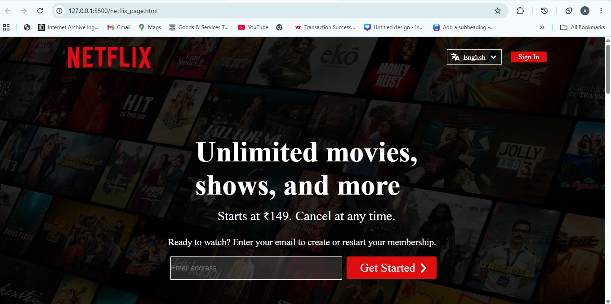
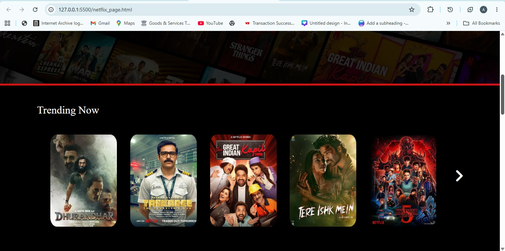
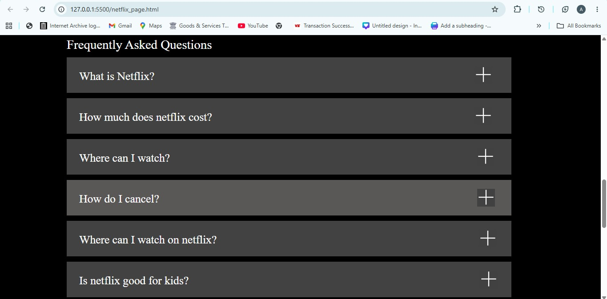
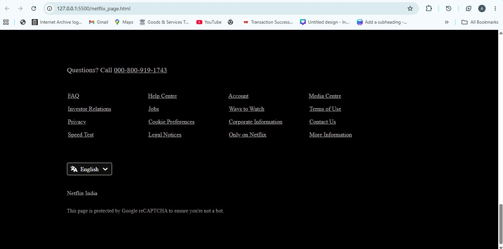

# Netflix Clone

This is a front-end clone of the Netflix homepage built using HTML and CSS. I created this project to practice webpage structuring, CSS layouts, and responsive design by recreating a real-world website.

## Features

- Netflix-inspired homepage layout
- Navigation bar
- Hero section
- Feature highlights
- F&Q section
- Footer

## Technologies Used

- HTML
- CSS

## What I Learned

While building this project, I got hands-on practice with:

- Structuring webpages using HTML
- Styling using CSS
- Flexbox for layout design
- Positioning and spacing elements
- Creating reusable sections
- Organizing project files

I also learned how to use Git and GitHub to manage my code.

## Future Improvements

Some features I'd like to add in the future:

- Make the website fully responsive for all screen sizes
- Add JavaScript for interactivity
- Add login and signup pages

## Screenshots
<h2>📸 Project Preview</h2>

  

  

  

  

  

## Author

**Avani Chauhan**
GitHub: https://github.com/avanichauhan14
